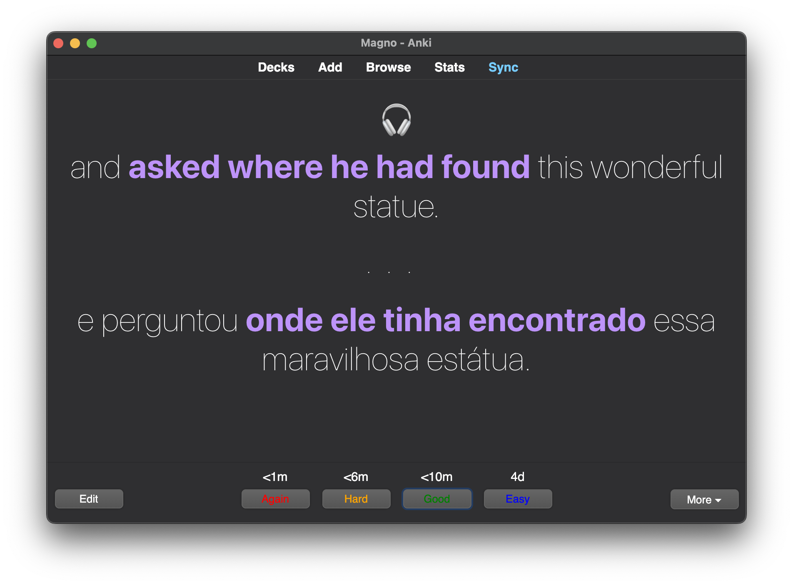
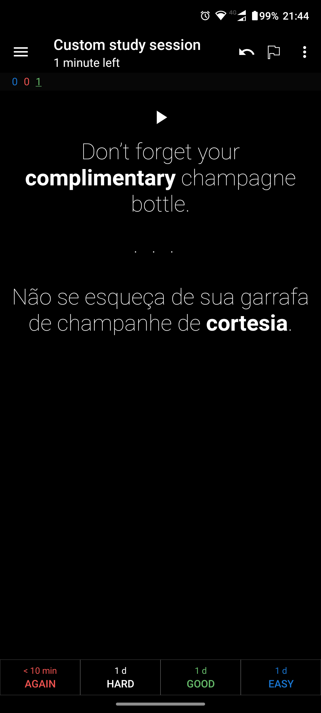

[](https://apps.ankiweb.net/)

# My Anki

> Powerful, intelligent flash cards. Remembering things just became much easier.

## Preview

| macOS | Android (AnkiDroid) |
| - | - |
|  |  |

## [Template](https://docs.ankiweb.net/templates/intro.html)

### Front

```html
{{ Audio }}

<p>{{ Front }}</p>
```

### Back

```html
{{ FrontSide }}

<hr id="answer">

{{ Back }}
```

### Styling

```css
* {
  margin: 0;
  padding: 0;
  box-sizing: border-box;
  -webkit-font-smoothing: antialiased;
  -moz-osx-font-smoothing: grayscale;
}

*::before,
*::after {
  box-sizing: inherit;
}

html {
  font-size: 62.5%;
}

body {
  background: #1b1b1b;
  color: #ffffff;
  font-family: -apple-system, BlinkMacSystemFont, 'Segoe UI', Roboto, Oxygen, Ubuntu, Cantarell, 'Open Sans', 'Helvetica Neue', sans-serif;
}

hr {
  height: 0;
  display: block;
  border: 0;
  text-align: center;
  overflow: visible;
  margin-top: 5rem;
  margin-bottom: 4rem;
}

hr::before {
  content: '...';
  display: inline-block;
  position: relative;
  top: -3rem;
  font-size: 3rem;
  letter-spacing: .6em;
}

.replay-button::after {
  content: '🎧';
  display: block;
}

.replay-button .playImage {
  display: none;
}

.card {
  font-size: 3rem;
  text-align: center;
  font-weight: 100;
}

```

## Add-ons

- [Always On Top](https://ankiweb.net/shared/info/1760080335)
- [AwesomeTTS (Google Cloud Text-to-Speech & Microsoft Azure TTS) [unofficial]](https://ankiweb.net/shared/info/814349176)
- [Button Colours (Good, Again)](https://ankiweb.net/shared/info/2494384865)
- [More Decks Stats and Time Left](https://ankiweb.net/shared/info/1556734708)
- [More Overview Stats 2.1](https://ankiweb.net/shared/info/738807903)
- [Syntax Highlighting for Code](https://ankiweb.net/shared/info/1463041493)
- [Review Heatmap](https://github.com/glutanimate/review-heatmap>)

## [Backup](https://docs.ankiweb.net/files.html#backups)

### File Locations

- macOS `~/Library/Application\ Support/Anki2`
- Linux `~/.local/share/Anki2`
- Windows `%APPDATA%\Anki2`

## Troubleshooting

<details>

  <summary>Sound and video on cards will not function until mpv or mplayer is installed</summary>

  Install [mpv](https://mpv.io/installation/) media player

</details>
